# V-SIGN — Use Case Diagram (PlantUML)

Paste code vào: https://www.plantuml.com/plantuml/uml/

```plantuml
@startuml V-SIGN_UseCase_Diagram

!theme plain
skinparam backgroundColor #FAFAFA
skinparam actorStyle awesome

skinparam usecase {
  BackgroundColor #EBF5FB
  BorderColor #2E86C1
  FontSize 12
  FontName Arial
}

skinparam actor {
  BackgroundColor #EAF7EA
  BorderColor #1E8449
  FontSize 12
  FontName Arial
}

skinparam package {
  BackgroundColor #FDFEFE
  BorderColor #AAB7B8
  FontSize 13
  FontStyle bold
}

skinparam ArrowColor #555555
skinparam ArrowThickness 1.2

' ==========================================
' ACTORS
' ==========================================

actor "Guest" as guest
actor "Basic User" as basic
actor "Premium User" as premium
actor "Admin" as admin
actor "Payment Gateway\n(MoMo / ZaloPay)" as gateway <<external>>
actor "MediaPipe Engine\n(Client-side AI)" as mediapipe <<external>>

' Inheritance
basic    -up-|> guest    : inherits
premium  -up-|> basic    : inherits

' ==========================================
' SUBSYSTEM 1: AUTHENTICATION
' ==========================================

package "Authentication" {
  usecase "Đăng ký tài khoản"       as UC_REGISTER
  usecase "Đăng nhập"               as UC_LOGIN
  usecase "Đăng nhập Google OAuth"  as UC_OAUTH
  usecase "Xem & Chỉnh sửa Profile" as UC_PROFILE
  usecase "Đổi mật khẩu"           as UC_CHANGEPW
}

guest   --> UC_REGISTER
guest   --> UC_LOGIN
guest   --> UC_OAUTH
basic   --> UC_PROFILE
basic   --> UC_CHANGEPW

UC_OAUTH .up.> UC_LOGIN : <<extend>>

' ==========================================
' SUBSYSTEM 2: LEARNING
' ==========================================

package "Learning" {
  usecase "Xem danh sách Unit"        as UC_BROWSE_UNIT
  usecase "Xem danh sách Chapter"     as UC_BROWSE_CHAPTER
  usecase "Xem bài học (Video)"       as UC_WATCH_LESSON
  usecase "Đánh dấu bài đã hoàn thành" as UC_COMPLETE_LESSON
  usecase "Mở khóa bài kế tiếp"      as UC_UNLOCK_NEXT
  usecase "[Paywall] Yêu cầu Premium" as UC_PAYWALL
}

basic   --> UC_BROWSE_UNIT
basic   --> UC_BROWSE_CHAPTER
basic   --> UC_WATCH_LESSON
basic   --> UC_COMPLETE_LESSON

UC_COMPLETE_LESSON .down.> UC_UNLOCK_NEXT        : <<include>>
UC_BROWSE_CHAPTER  .right.> UC_PAYWALL           : <<extend>>\n[is_premium=TRUE\n& Basic User]

' ==========================================
' SUBSYSTEM 3: ASSESSMENT
' ==========================================

package "Assessment" {
  usecase "Làm Quiz MCQ"             as UC_MCQ
  usecase "Luyện tập AI (AI Quiz)"   as UC_AI_QUIZ
  usecase "Kích hoạt Camera"         as UC_CAMERA
  usecase "Nhận diện Ký hiệu tay"   as UC_DETECT
  usecase "Thi thử có bấm giờ"      as UC_MOCK_TEST
  usecase "Xem kết quả & điểm số"   as UC_VIEW_RESULT
}

basic   --> UC_MCQ
premium --> UC_AI_QUIZ
premium --> UC_MOCK_TEST
basic   --> UC_VIEW_RESULT

UC_AI_QUIZ   .down.> UC_CAMERA   : <<include>>
UC_CAMERA    .down.> UC_DETECT   : <<include>>
UC_DETECT    ---     mediapipe   : uses
UC_MCQ       .right.> UC_VIEW_RESULT : <<include>>
UC_AI_QUIZ   .right.> UC_VIEW_RESULT : <<include>>
UC_MOCK_TEST .right.> UC_VIEW_RESULT : <<include>>

' ==========================================
' SUBSYSTEM 4: GAMIFICATION
' ==========================================

package "Gamification" {
  usecase "Nhận XP sau bài học"     as UC_EARN_XP
  usecase "Cập nhật Streak"         as UC_STREAK
  usecase "Nhận Huy hiệu (Badge)"   as UC_BADGE
  usecase "Xem Bảng xếp hạng"      as UC_LEADERBOARD
  usecase "Xem Hồ sơ Gamification" as UC_GAME_PROFILE
}

basic   --> UC_LEADERBOARD
basic   --> UC_GAME_PROFILE

UC_COMPLETE_LESSON .down.> UC_EARN_XP  : <<include>>
UC_VIEW_RESULT     .down.> UC_EARN_XP  : <<include>>
UC_EARN_XP         .down.> UC_STREAK   : <<include>>
UC_STREAK          .down.> UC_BADGE    : <<extend>>\n[milestone reached]

' ==========================================
' SUBSYSTEM 5: DICTIONARY
' ==========================================

package "Dictionary (VSL)" {
  usecase "Duyệt từ điển theo danh mục" as UC_DICT_BROWSE
  usecase "Tìm kiếm từ điển"           as UC_DICT_SEARCH
  usecase "Xem chi tiết từ (Video)"    as UC_DICT_DETAIL
}

guest   --> UC_DICT_BROWSE
guest   --> UC_DICT_SEARCH
guest   --> UC_DICT_DETAIL

UC_DICT_BROWSE .right.> UC_DICT_DETAIL : <<extend>>
UC_DICT_SEARCH .right.> UC_DICT_DETAIL : <<extend>>

' ==========================================
' SUBSYSTEM 6: MONETIZATION
' ==========================================

package "Monetization" {
  usecase "Xem trang Paywall"           as UC_VIEW_PAYWALL
  usecase "Chọn gói Premium"            as UC_SELECT_PLAN
  usecase "Thanh toán QR (MoMo/Zalo)"  as UC_PAYMENT
  usecase "Xác nhận Webhook"            as UC_WEBHOOK
  usecase "Nâng cấp account_type"       as UC_UPGRADE
  usecase "Xem lịch sử thanh toán"      as UC_PAY_HISTORY
}

basic   --> UC_VIEW_PAYWALL
basic   --> UC_SELECT_PLAN
basic   --> UC_PAYMENT
basic   --> UC_PAY_HISTORY

UC_PAYWALL      .up.> UC_VIEW_PAYWALL   : <<extend>>
UC_SELECT_PLAN  .down.> UC_PAYMENT      : <<include>>
UC_PAYMENT      ---    gateway          : requests QR
gateway         ---    UC_WEBHOOK       : sends Webhook
UC_WEBHOOK      .down.> UC_UPGRADE      : <<include>>\n[status=SUCCESS]

' ==========================================
' SUBSYSTEM 7: ADMIN
' ==========================================

package "Admin Panel" {
  usecase "Quản lý nội dung\n(Unit/Chapter/Lesson)" as UC_MANAGE_CONTENT
  usecase "Quản lý người dùng"                       as UC_MANAGE_USERS
  usecase "Quản lý từ điển VSL"                     as UC_MANAGE_DICT
  usecase "Xem thống kê & Analytics"                as UC_ANALYTICS
  usecase "Đối soát giao dịch"                       as UC_RECONCILE
}

admin --> UC_MANAGE_CONTENT
admin --> UC_MANAGE_USERS
admin --> UC_MANAGE_DICT
admin --> UC_ANALYTICS
admin --> UC_RECONCILE

@enduml
```

---

## Ghi chú Diagram

### Actors
| Actor | Mô tả |
|---|---|
| **Guest** | Chưa đăng nhập — chỉ xem Dictionary và Register/Login |
| **Basic User** | Đã đăng nhập, tài khoản miễn phí |
| **Premium User** | Mở khóa AI Quiz, Chapter premium |
| **Admin** | Quản lý nội dung, đối soát giao dịch |
| **Payment Gateway** | Actor ngoài: MoMo / ZaloPay gửi Webhook |
| **MediaPipe Engine** | Actor ngoài: chạy client-side, không phải server |

### Quan hệ đặc biệt
| Quan hệ | Ý nghĩa |
|---|---|
| `<<include>>` | Luôn luôn xảy ra (bắt buộc) |
| `<<extend>>` | Chỉ xảy ra khi thỏa điều kiện |
| `inherits` | Actor con kế thừa toàn bộ UC của Actor cha |
