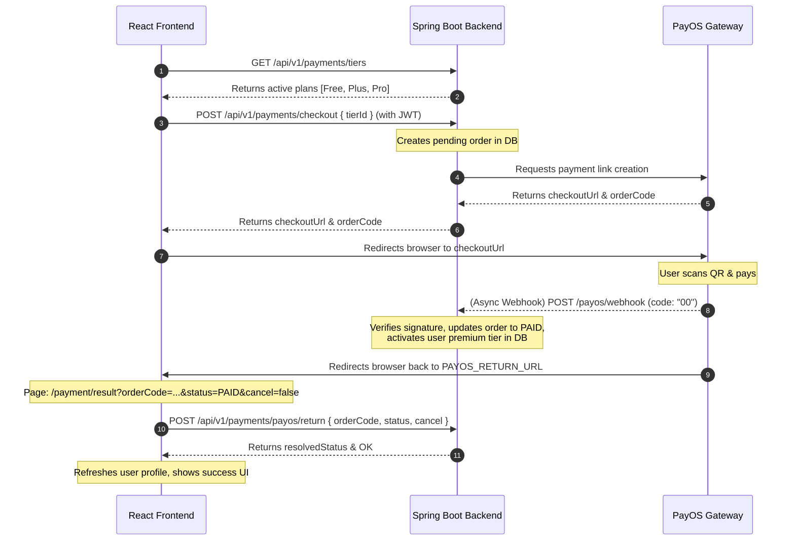

# V-Sign PayOS Frontend Integration Guide

This guide is designed for developers and coding agents integrating the completed PayOS backend payment system into the Vite/React frontend located at `D:\v-sign-fe`.

---

## 1. Overview of the Payment Flow



---

## 2. API Endpoint Specifications (Calls to Backend)

All endpoints below assume the base path of the backend API (e.g., `https://apivsignvn.social/api/v1` or `http://localhost:8080/V-sign/api/v1`).

### A. Get Active Subscription Tiers
*   **Endpoint**: `GET /payments/tiers`
*   **Authentication**: None (Public)
*   **Response**: `200 OK`
    ```json
    [
      {
        "tierId": "00000000-0000-0000-0000-000000000002",
        "title": "plus",
        "amount": 49000,
        "noMonth": 1,
        "limitedToken": 100,
        "isActive": true
      },
      {
        "tierId": "00000000-0000-0000-0000-000000000003",
        "title": "pro",
        "amount": 99000,
        "noMonth": 1,
        "limitedToken": 999,
        "isActive": true
      }
    ]
    ```

### B. Create Payment Checkout Link
*   **Endpoint**: `POST /payments/checkout`
*   **Authentication**: Required (`Authorization: Bearer <JWT_TOKEN>`)
*   **Request Body**:
    ```json
    {
      "tierId": "00000000-0000-0000-0000-000000000002"
    }
    ```
*   **Response**: `200 OK`
    ```json
    {
      "orderId": "uuid-string",
      "orderCode": 582739123,
      "checkoutUrl": "https://pay.payos.vn/web/abc123xyz",
      "amount": 49000,
      "status": "PENDING"
    }
    ```
*   **Error Responses**:
    *   `401 Unauthorized` - Missing or expired JWT token.
    *   `409 Conflict` (IllegalStateException) - User already has a paid active subscription. Suggest showing an alert: *"You already have an active paid subscription!"*

### C. Synchronize Redirect Return URL Status
*   **Endpoint**: `POST /payments/payos/return`
*   **Authentication**: Required (`Authorization: Bearer <JWT_TOKEN>`)
*   **Request Body**:
    ```json
    {
      "orderCode": 582739123,
      "status": "PAID",
      "cancel": false
    }
    ```
*   **Response**: `200 OK`
    ```json
    {
      "orderCode": 582739123,
      "resolvedStatus": "PAID",
      "message": "OK"
    }
    ```

### D. Check Current Active Subscription Tier
*   **Endpoint**: `GET /me`
*   **Authentication**: Required (`Authorization: Bearer <JWT_TOKEN>`)
*   **Response**: `200 OK`
    ```json
    {
      "success": true,
      "message": "Profile loaded",
      "data": {
        "id": "00000000-0000-0000-0000-000000000001",
        "email": "user@vsign.com",
        "fullName": "User Name",
        "role": "USER",
        "accountType": "BASIC",
        "subscription": {
          "planType": "PLUS",
          "status": "ACTIVE",
          "startDate": "2026-06-18T00:43:47",
          "endDate": "2026-07-18T00:43:47"
        }
      }
    }
    ```
*   **FE Behavior**: Read the `data.subscription.planType` (e.g., `"FREE"`, `"PLUS"`, `"PRO"`) and check if `data.subscription.status` is `"ACTIVE"` to verify the subscription is alive. If `status` is `"INACTIVE"`, fall back to free access behavior.

---

## 3. Frontend Routes to Implement

You need to set up/register two URL paths on the Frontend application:

1.  **`/payment/result`** (Maps to backend configuration parameter `PAYOS_RETURN_URL`):
    *   Catches parameters: `?code=...&id=...&cancel=...&status=...&orderCode=...`
    *   Calls backend `POST /payments/payos/return` immediately.
    *   Displays final Payment Success / Failure card.
2.  **`/payment/cancel`** (Maps to backend configuration parameter `PAYOS_CANCEL_URL`):
    *   Displays cancellation notification and offers button to return to the plans page.

---

## 4. Frontend Implementation Templates (React + Axios)

### A. API Client Service (`src/services/paymentService.ts`)
Create or edit your payment service layer to invoke these backend endpoints.

```typescript
import axios from 'axios';

const API_BASE_URL = import.meta.env.VITE_API_BASE_URL || 'https://apivsignvn.social/api/v1';

export interface SubscriptionTier {
  tierId: string;
  title: string;
  amount: number;
  noMonth: number;
  limitedToken: number;
  isActive: boolean;
}

export interface CheckoutResponse {
  orderId: string;
  orderCode: number;
  checkoutUrl: string;
  amount: number;
  status: string;
}

export interface SyncReturnRequest {
  orderCode: number;
  status: string;
  cancel: boolean;
}

export interface SyncReturnResponse {
  orderCode: number;
  resolvedStatus: string;
  message: string;
}

const getHeaders = () => {
  const token = localStorage.getItem('token'); // adjust depending on auth storage
  return {
    Authorization: token ? `Bearer ${token}` : '',
  };
};

export const paymentService = {
  getTiers: async (): Promise<SubscriptionTier[]> => {
    const response = await axios.get<SubscriptionTier[]>(`${API_BASE_URL}/payments/tiers`);
    return response.data;
  },

  createCheckout: async (tierId: string): Promise<CheckoutResponse> => {
    const response = await axios.post<CheckoutResponse>(
      `${API_BASE_URL}/payments/checkout`,
      { tierId },
      { headers: getHeaders() }
    );
    return response.data;
  },

  syncReturnStatus: async (payload: SyncReturnRequest): Promise<SyncReturnResponse> => {
    const response = await axios.post<SyncReturnResponse>(
      `${API_BASE_URL}/payments/payos/return`,
      payload,
      { headers: getHeaders() }
    );
    return response.data;
  }
};
```

### B. Payment Result Component (`src/components/PaymentResult.tsx`)
Implement this component to handle user landing after PayOS payment completes.

```tsx
import React, { useEffect, useState } from 'react';
import { useSearchParams, useNavigate } from 'react-router-dom';
import { paymentService } from '../services/paymentService';

export const PaymentResult: React.FC = () => {
  const [searchParams] = useSearchParams();
  const navigate = useNavigate();
  const [loading, setLoading] = useState(true);
  const [error, setError] = useState<string | null>(null);
  const [resolvedStatus, setResolvedStatus] = useState<string>('PENDING');

  useEffect(() => {
    const syncPayment = async () => {
      try {
        const orderCode = searchParams.get('orderCode');
        const status = searchParams.get('status') || 'PENDING';
        const cancel = searchParams.get('cancel') === 'true';

        if (!orderCode) {
          setError('Missing order code parameters.');
          setLoading(false);
          return;
        }

        // Send payload to backend to verify redirection status
        const res = await paymentService.syncReturnStatus({
          orderCode: parseInt(orderCode, 10),
          status,
          cancel,
        });

        setResolvedStatus(res.resolvedStatus);
        
        // Trigger User Profile Reload here if you have auth context
        // e.g., auth.refreshUserProfile();
      } catch (err: any) {
        console.error(err);
        setError(err.response?.data?.message || 'Failed to sync payment status with server.');
      } finally {
        setLoading(false);
      }
    };

    syncPayment();
  }, [searchParams]);

  if (loading) {
    return <div className="text-center p-10 text-lg">Verifying your payment transaction...</div>;
  }

  if (error) {
    return (
      <div className="max-w-md mx-auto my-10 p-6 bg-red-50 border border-red-200 rounded-lg text-center shadow">
        <h2 className="text-red-600 text-xl font-bold mb-2">Verification Error</h2>
        <p className="text-gray-700 mb-4">{error}</p>
        <button onClick={() => navigate('/premium')} className="px-4 py-2 bg-red-600 text-white rounded hover:bg-red-700">
          Try Again
        </button>
      </div>
    );
  }

  const isSuccess = resolvedStatus === 'PAID';

  return (
    <div className="max-w-md mx-auto my-10 p-8 bg-white border border-gray-200 rounded-xl text-center shadow-lg">
      {isSuccess ? (
        <>
          <div className="w-16 h-16 bg-green-100 rounded-full flex items-center justify-center mx-auto mb-4 text-green-600 text-3xl">✓</div>
          <h2 className="text-green-700 text-2xl font-bold mb-2">Payment Successful!</h2>
          <p className="text-gray-600 mb-6">Your Premium subscription has been successfully activated. Enjoy full access!</p>
          <button onClick={() => navigate('/courses')} className="w-full py-3 bg-indigo-600 hover:bg-indigo-700 text-white font-medium rounded-lg transition">
            Go to Courses
          </button>
        </>
      ) : (
        <>
          <div className="w-16 h-16 bg-amber-100 rounded-full flex items-center justify-center mx-auto mb-4 text-amber-600 text-3xl">!</div>
          <h2 className="text-amber-700 text-2xl font-bold mb-2">Payment Unresolved</h2>
          <p className="text-gray-600 mb-6">The payment link was cancelled or has expired without verification. Status: {resolvedStatus}</p>
          <button onClick={() => navigate('/premium')} className="w-full py-3 bg-gray-800 hover:bg-gray-900 text-white font-medium rounded-lg transition">
            View Pricing Plans
          </button>
        </>
      )}
    </div>
  );
};
```

---

## 5. Summary Checkpoints for the Front-End Agent

*   Ensure routes for `/payment/result` and `/payment/cancel` are registered in React Router (`BrowserRouter`).
*   Ensure Axios interceptor correctly attaches the JWT Token from storage.
*   Once a successful `PAID` response is verified in `/payment/result`, trigger a state refresh (e.g. context reload, user info re-fetch) so that locks on courses/dictionary are optimistic and correct in the UI.
