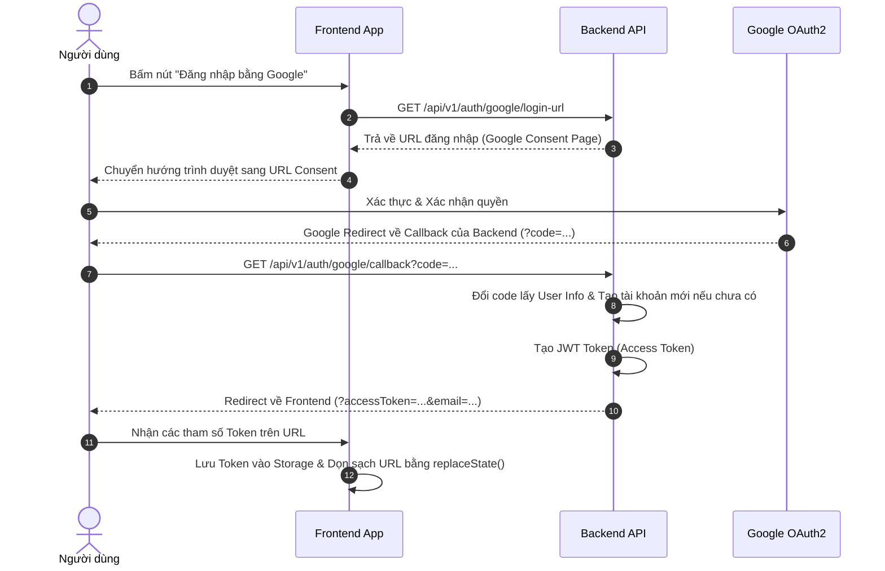

# Hướng dẫn Tích hợp Google OAuth2 & Khôi phục Mật khẩu (Frontend)

Tài liệu này hướng dẫn chi tiết cách Frontend (Vite/React) tích hợp các chức năng **Đăng nhập bằng Google** và **Khôi phục mật khẩu qua Email** thông qua các API mới của Backend.

---

## 1. Tích hợp Google OAuth2 Login

Luồng đăng nhập Google được thiết kế theo mô hình **Backend-driven** để đảm bảo tính an toàn cho Token.



### Bước 1: Gọi API lấy URL đăng nhập và chuyển hướng
Khi người dùng click vào nút **"Login with Google"**, Frontend thực hiện gọi API lấy URL ủy quyền:
*   **Endpoint:** `GET /api/v1/auth/google/login-url`
*   **Response:**
    ```json
    {
      "success": true,
      "message": "Google login URL generated",
      "data": "https://accounts.google.com/o/oauth2/v2/auth?client_id=..."
    }
    ```
*   **Xử lý ở FE:** Chuyển hướng trình duyệt của người dùng đến giá trị `data` nhận được:
    ```javascript
    window.location.href = response.data.data;
    ```

### Bước 2: Xử lý Redirect Callback tại trang `/home` (hoặc OAuth Redirect Page)
Sau khi người dùng đăng nhập thành công ở Google, Backend xử lý callback nội bộ, tạo JWT và chuyển hướng người dùng quay trở lại địa chỉ Frontend được cấu hình (`FRONTEND_OAUTH_SUCCESS_URL` - mặc định là `/home`).

Đường dẫn trả về sẽ kèm theo các query parameters như sau:
`https://v-sign.vercel.app/home?accessToken=JWT_TOKEN&tokenType=Bearer&expiresIn=3600&email=user%40gmail.com`

**Xử lý ở FE:**
1. **Lấy Token từ URL:**
   ```javascript
   const urlParams = new URLSearchParams(window.location.search);
   const accessToken = urlParams.get('accessToken');
   const email = urlParams.get('email');
   ```
2. **Lưu Token:** Lưu `accessToken` vào `localStorage`, `sessionStorage` hoặc Redux/Zustand Store để đính kèm vào header `Authorization: Bearer <token>` cho các API sau.
3. **BẢO MẬT: Dọn sạch URL ngay lập tức** để tránh lộ Token trong lịch sử trình duyệt hoặc Header Referrer:
   ```javascript
   window.history.replaceState({}, document.title, window.location.pathname);
   ```

### Bước 3: Xử lý lỗi đăng nhập
Nếu có lỗi xảy ra (ví dụ: Tài khoản bị khóa, lỗi kết nối Google), Backend sẽ redirect về trang chủ kèm mã lỗi:
`https://v-sign.vercel.app/?error=account_disabled` hoặc `?error=oauth_failed`

*   **Xử lý ở FE:** Đọc tham số `error` từ URL, dọn sạch URL và hiển thị thông báo Alert/Toast lỗi tương ứng cho người dùng (ví dụ: *"Tài khoản của bạn đã bị khóa"*).

---

## 2. Luồng Khôi phục Mật khẩu (Forgot & Reset Password)

Luồng khôi phục mật khẩu sử dụng cơ chế bảo mật **Double-Hashing Token** với thời gian hết hạn là **15 phút**.

### Bước 1: Người dùng yêu cầu khôi phục mật khẩu (Forgot Password)
Frontend hiển thị Form nhập Email của tài khoản cần khôi phục.
*   **Endpoint:** `POST /api/v1/auth/password-reset/request`
*   **Request Body:**
    ```json
    {
      "email": "user@example.com"
    }
    ```
*   **Response:** Luôn trả về `200 OK` bất kể email có tồn tại hay không (để tránh rò rỉ danh sách tài khoản):
    ```json
    {
      "success": true,
      "message": "Password reset requested",
      "data": null
    }
    ```
*   **Xử lý ở FE:** Hiển thị thông báo chung: *"Nếu email tồn tại trên hệ thống, bạn sẽ nhận được một đường liên kết khôi phục mật khẩu gửi qua email trong ít phút."*

### Bước 2: Thiết lập trang Đặt lại mật khẩu mới (`/reset-password`)
Đường dẫn khôi phục trong email gửi cho người dùng có định dạng:
`https://v-sign.vercel.app/reset-password?token=RAW_TOKEN_STRING`

1. Tại route `/reset-password`, Frontend cần trích xuất tham số `token` từ URL query.
2. Hiển thị form gồm 2 trường nhập: **Mật khẩu mới** và **Xác nhận mật khẩu**.
3. **Quy tắc validate mật khẩu mới:** Tối thiểu 8 ký tự, phải bao gồm ít nhất một chữ viết hoa và một chữ số.

### Bước 3: Gửi thông tin Đặt lại mật khẩu thành công
Khi người dùng submit form mật khẩu mới, Frontend gửi request xác nhận:
*   **Endpoint:** `POST /api/v1/auth/password-reset/complete`
*   **Request Body:**
    ```json
    {
      "token": "RAW_TOKEN_STRING",
      "newPassword": "NewSecurePassword123",
      "confirmPassword": "NewSecurePassword123"
    }
    ```
*   **Phản hồi:**
    *   **Thành công (200 OK):**
        ```json
        {
          "success": true,
          "message": "Password reset successfully completed",
          "data": null
        }
        ```
        *   *Xử lý ở FE:* Hiển thị thông báo thành công và chuyển hướng người dùng về trang Đăng nhập (`/login`).
    *   **Thất bại (400 Bad Request):**
        *   Mã lỗi `INVALID_TOKEN`: Token không hợp lệ hoặc đã từng được sử dụng.
        *   Mã lỗi `TOKEN_EXPIRED`: Token đã hết hạn 15 phút.
        *   *Xử lý ở FE:* Hiển thị thông báo lỗi tương ứng và nút *"Yêu cầu lại mã mới"*.
