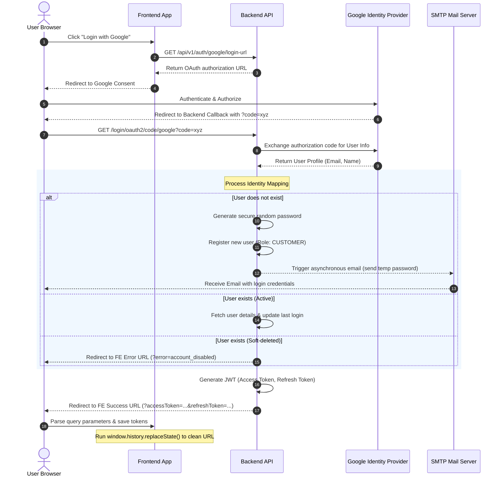
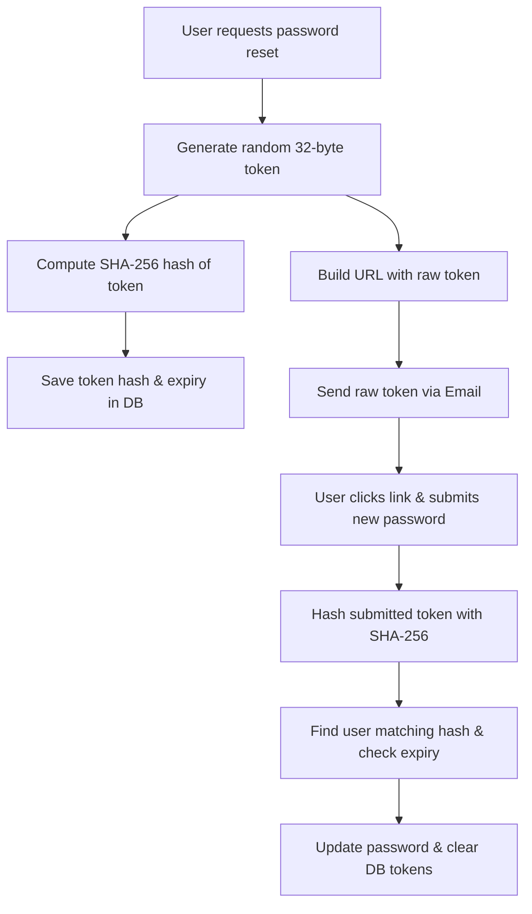

# Google OAuth & Email Notification Integration Guide

This guide provides a comprehensive template and architectural blueprint for integrating a backend-driven **Google OAuth2 Login** along with an **Email Notification (SMTP)** service. This template is designed to be highly reusable and can be integrated into any backend project (e.g., Spring Boot, Node.js, FastAPI, etc.).

---

## 1. System Architecture & Authentication Flow

The system employs a backend-driven OAuth2 Authorization Code flow combined with an asynchronous/resilient email notification system.



---

## 2. Prerequisites & Global Configuration

### A. Environment Variables & Properties
Configure the following configurations on your environment or properties file:

```properties
# Google OAuth2 Credentials
oauth2.google.client-id=YOUR_GOOGLE_CLIENT_ID
oauth2.google.client-secret=YOUR_GOOGLE_CLIENT_SECRET
oauth2.google.redirect-uri-template={baseUrl}/login/oauth2/code/google

# SMTP Mail Server Configuration
mail.host=smtp.gmail.com
mail.port=587
mail.username=your-system-email@gmail.com
mail.password=your-app-specific-password
mail.smtp.auth=true
mail.smtp.starttls.enable=true
mail.smtp.starttls.required=true
mail.from-address=History Talk <noreply@historytalk.com>

# Frontend Integration Hooks
frontend.oauth-success-url=https://yourdomain.com/oauth-redirect
frontend.oauth-failure-url=https://yourdomain.com/login?error=oauth_failed
frontend.password-reset-url=https://yourdomain.com/reset-password
```

### B. Core Database Entities (Schema Requirements)
The database must support the following schema definitions for users, passwords, and password resets:

| Field Name | Type | Constraints | Description |
| :--- | :--- | :--- | :--- |
| `id` | UUID / INT | Primary Key | Unique user identifier |
| `email` | String | Unique, Non-null | User's primary email address (lowercased) |
| `username` | String | Unique, Non-null | Display name or system username |
| `password_hash` | String | Non-null | BCrypt hashed password |
| `role` | Enum / String | Non-null | e.g. `CUSTOMER`, `ADMIN` |
| `deleted_at` | Timestamp | Nullable | For soft-delete checks |
| `pwd_reset_token_hash` | String | Nullable, Indexed | SHA-256 hash of password reset tokens |
| `pwd_reset_expiry` | Timestamp | Nullable | Expiration of password reset tokens |

---

## 3. Module 1: Backend Google OAuth2 Login

### A. Route Interceptor / Security Filter Chain
1. Configure your framework's security engine (e.g. Spring Security, PassportJS) to guard paths but whitelist Google OAuth endpoints.
2. The core callbacks should be:
   - Login Initiation: `/oauth2/authorization/google`
   - Token/Code Exchange: `/login/oauth2/code/google`

### B. Identity Mapping & Account Creation Strategy
Upon successfully retrieving the user profile from Google (`email`, `name`):

1. **Email Normalization:** Normalize the email by lowercasing and trimming whitespaces before querying.
2. **Account Checks:**
   - If user exists and is active, authenticate.
   - If user exists but is soft-deleted (`deleted_at != null`), reject authorization and redirect to the frontend failure URL.
   - If user does not exist, create a new record:
     - Set `email` from Google.
     - Auto-generate a random temporary password following a distinct pattern: e.g. `HT-GOOGLE-<uuid-first-12>` (hash it with BCrypt before saving).
     - Clean Google's display name to fit username rules (alphanumeric, spaces/underscores allowed). If the username conflicts, append incrementing digits (e.g., `john_doe1`, `john_doe2`) until unique.
     - Default `role` = `CUSTOMER`.

### C. Handing off JWTs to Frontend
After successful mapping, issue JWTs. Since OAuth uses a redirect flow, pass the credentials back to the frontend:
1. Redirect the browser to: `${frontend.oauth-success-url}?accessToken=JWT_ACCESS&refreshToken=JWT_REFRESH&tokenType=Bearer&expiresIn=3600&email=USER_EMAIL`
2. **Security Constraint:** The Frontend must parse these parameters and immediately execute `window.history.replaceState({}, document.title, window.location.pathname)` to prevent JWTs from leaking through browser histories or referrer logs.

---

## 4. Module 2: Notifications & SMTP Integration

### A. SMTP Service Component
Implement a non-blocking service to handle SMTP operations. Ensure connection timeouts and thread pools are configured so that mail delivery issues do not block authentication threads.

#### Pseudocode Example:
```
class NotificationService {
    function sendEmail(to, subject, bodyHtml) {
        async {
            try {
                // Setup SMTP properties
                // Prepare MimeMessage
                // Send mail via JavaMailSender / nodemailer / etc.
            } catch (Exception e) {
                logger.error("Failed to send email to: " + to + " Reason: " + e.getMessage());
                // Do not throw exception if called from OAuth pipeline to prevent transaction rollbacks
            }
        }
    }
}
```

### B. Temporary Password Notification Flow
1. When a **new user** is created via the Google OAuth flow, trigger a temporary password email immediately after the transaction commits.
2. **Resilience Policy:** Wrap the notification trigger in a `try-catch` block. If the mail server is down or authentication fails, **log the warning but allow the user login flow to succeed**. This ensures user onboarding is not blocked by transient mail-delivery failures.
3. The email body must contain the temporary credentials and instruct the user to change their password via the user settings page.

### C. Password Reset Flow (Forgot Password)
Use a double-hashed token strategy to protect against database leakages:



1. **Step 1: Request Reset (`POST /api/v1/auth/forgot-password`)**
   - Accept `email`.
   - Regardless of whether the email is found in the database, return a generic success message: `"If the email address exists in our system, you will receive a password reset link shortly."` (prevents account enumeration).
   - Generate a cryptographically secure, random 32-byte token (base64url-encoded).
   - Hash this token with **SHA-256**.
   - Save the hash (`pwd_reset_token_hash`) and an expiry time (e.g., current time + 15 minutes) on the User row.
   - Send the **raw token** in a link to the user's email: `${frontend.password-reset-url}?token=RAW_TOKEN`.

2. **Step 2: Complete Reset (`POST /api/v1/auth/reset-password`)**
   - Accept `token`, `newPassword`, and `confirmPassword`.
   - Hash the incoming `token` with SHA-256.
   - Query the database for a user matching the calculated token hash.
   - Check if `pwd_reset_expiry` has passed.
   - If valid, update `password_hash` with BCrypt(`newPassword`), and clear `pwd_reset_token_hash` and `pwd_reset_expiry`.

---

## 5. Security Hardening Checklist

- [ ] **Query Parameter Sanitization:** Ensure the frontend cleans the URL immediately after parsing tokens (`replaceState`).
- [ ] **Hash Verification Tokens:** Never store raw forgot-password tokens in the database. Always store a cryptographically secure hash (SHA-256).
- [ ] **Token Expiration:** Restrict password reset tokens to a maximum validity of 15 minutes.
- [ ] **Rate Limiting:** Protect `/api/v1/auth/forgot-password` with rate-limiting filters (e.g. maximum 3 requests per IP/email per hour) to avoid SMTP spamming.
- [ ] **Token Revocation Check:** Ensure your token filter checks token blacklists/redis caches on requests, particularly in clustered setups.
