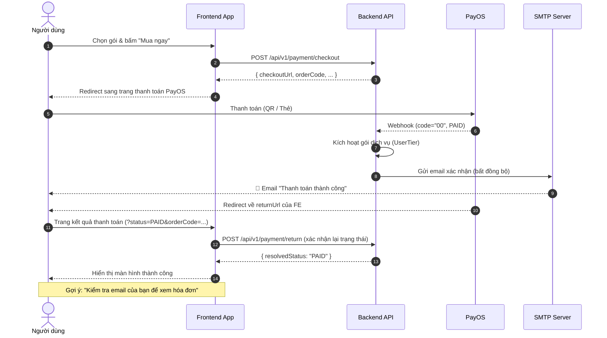

# Hướng dẫn Tích hợp Email Thông báo Thanh toán Thành công (Frontend)

**Ngày tạo:** 2026-06-18
**Phiên bản Backend:** Từ v0.0.1-SNAPSHOT (triển khai 2026-06-18)
**Tính năng:** Tự động gửi email xác nhận thanh toán sau khi gói dịch vụ được kích hoạt thành công.

---

## 1. Tổng quan

Kể từ phiên bản này, **Backend sẽ tự động gửi email xác nhận** đến người dùng sau mỗi giao dịch thanh toán thành công thông qua PayOS.

**Frontend KHÔNG cần gọi thêm bất kỳ API nào** cho tính năng này. Email được trigger hoàn toàn bởi Backend tại 2 luồng:

| Luồng | Trigger |
|---|---|
| PayOS Webhook (`code = "00"`) | Backend nhận webhook từ PayOS khi thanh toán hoàn tất |
| Return URL (`status = "PAID"`) | Backend xử lý khi FE redirect người dùng về sau thanh toán |

---

## 2. Luồng hoạt động đầy đủ



---

## 3. Nội dung email người dùng sẽ nhận

**Tiêu đề:** `[V-Sign] Xác nhận thanh toán thành công - Gói {tierName}`

**Nội dung bao gồm:**

| Trường | Mô tả |
|---|---|
| Lời chào | `Xin chào {fullName}` |
| Thông báo | Thanh toán gói `{tierName}` thành công |
| Mã đơn hàng | `#orderCode` |
| Số tiền | Định dạng VNĐ (ví dụ: `49.000 VNĐ`) |
| Ngày bắt đầu | Thời điểm kích hoạt gói |
| Ngày hết hạn | Thời điểm gói hết hiệu lực |

---

## 4. Khuyến nghị UX cho Frontend

Mặc dù email được gửi tự động, FE nên bổ sung thêm các UX hint để tăng trải nghiệm người dùng.

### 4.1 Màn hình kết quả thanh toán thành công

Sau khi nhận `resolvedStatus: "PAID"` từ API `/payment/return`, hiển thị thêm thông báo gợi ý:

```tsx
// Ví dụ với React + Toast
toast.success(
  "🎉 Thanh toán thành công! Kiểm tra email của bạn để xem hóa đơn xác nhận.",
  { duration: 6000 }
);
```

Hoặc hiển thị inline trên màn hình kết quả:

```tsx
<div className="payment-success-notice">
  <span>📧</span>
  <p>
    Hóa đơn xác nhận đã được gửi đến <strong>{userEmail}</strong>.
    Vui lòng kiểm tra hộp thư (kể cả thư mục Spam nếu không thấy).
  </p>
</div>
```

### 4.2 Thời điểm hiển thị gợi ý

| Điều kiện | Hành động |
|---|---|
| `resolvedStatus === "PAID"` | Hiển thị toast + banner email hint |
| `resolvedStatus === "CANCELLED"` | Hiển thị thông báo huỷ, không nhắc email |
| `resolvedStatus` khác / lỗi | Hiển thị trạng thái tương ứng |

### 4.3 Không cần thay đổi logic hiện tại

> ✅ Luồng gọi API `/payment/checkout` và `/payment/return` **giữ nguyên** như cũ.  
> ✅ Không cần thêm payload, header hay tham số mới.  
> ✅ Email sẽ **tự động** được gửi ngay cả khi FE không có gì thay đổi.

---

## 5. Tham chiếu API

### POST `/api/v1/payment/checkout`
Tạo link thanh toán PayOS.

**Request:**
```json
{
  "tierId": "uuid-cua-goi-dich-vu"
}
```

**Response:**
```json
{
  "success": true,
  "data": {
    "orderId": "...",
    "orderCode": 123456789,
    "checkoutUrl": "https://pay.payos.vn/web/...",
    "qrCode": "...",
    "amount": 49000,
    "status": "PENDING",
    "expiredAt": "2026-06-18T03:30:00"
  }
}
```

---

### POST `/api/v1/payment/return`
Xác nhận trạng thái sau khi người dùng được redirect về từ PayOS.

**Request:**
```json
{
  "orderCode": 123456789,
  "status": "PAID",
  "cancel": false
}
```

**Response (PAID):**
```json
{
  "success": true,
  "data": {
    "orderCode": 123456789,
    "resolvedStatus": "PAID",
    "message": "OK"
  }
}
```

> 🔔 Tại thời điểm Backend trả về `resolvedStatus: "PAID"`, email xác nhận đã được **đưa vào hàng đợi gửi bất đồng bộ** (`@Async`) — người dùng thường nhận được email trong vài giây.

---

## 6. Xử lý trường hợp người dùng không nhận được email

Frontend nên cung cấp liên kết hỗ trợ hoặc nút "Yêu cầu gửi lại" trong màn hình kết quả thanh toán. Hiện tại Backend chưa có endpoint resend email — nếu cần, đội FE có thể tạo ticket để Backend bổ sung sau.

---

## 7. Checklist tích hợp cho Frontend Dev

- [ ] Xác nhận luồng `/payment/checkout` → redirect PayOS → `/payment/return` hoạt động đúng.
- [ ] Thêm toast/banner gợi ý kiểm tra email sau khi nhận `resolvedStatus === "PAID"`.
- [ ] Test thực tế: Dùng tài khoản có email thật, thực hiện thanh toán test qua PayOS sandbox và xác nhận email được nhận.
- [ ] Kiểm tra màn hình trên cả mobile và desktop.
- [ ] Đảm bảo email hiển thị của người dùng (`userEmail`) được bind đúng vào UX hint.
``````````````